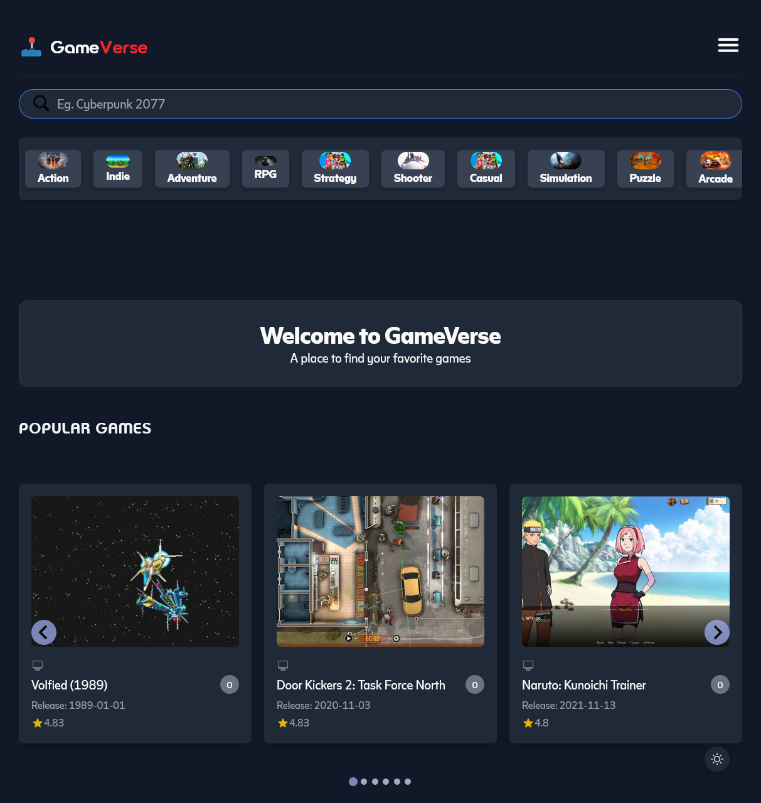
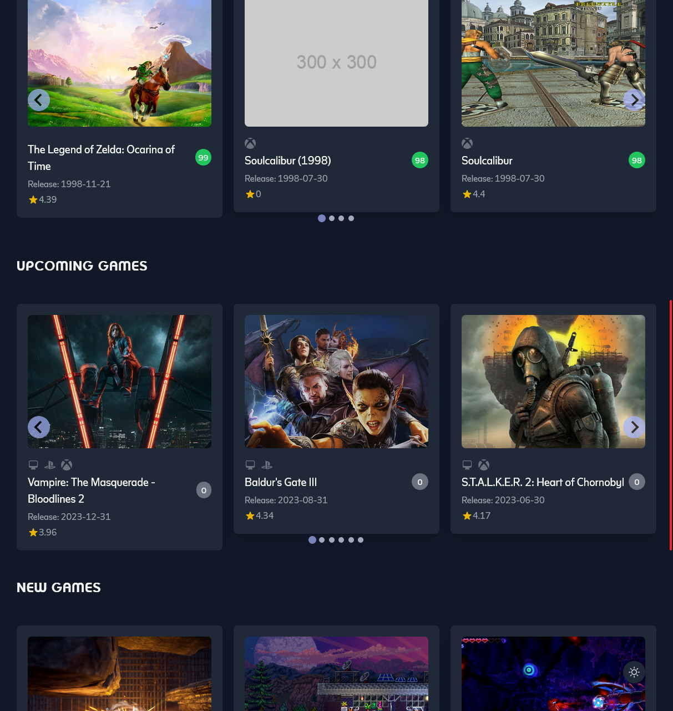
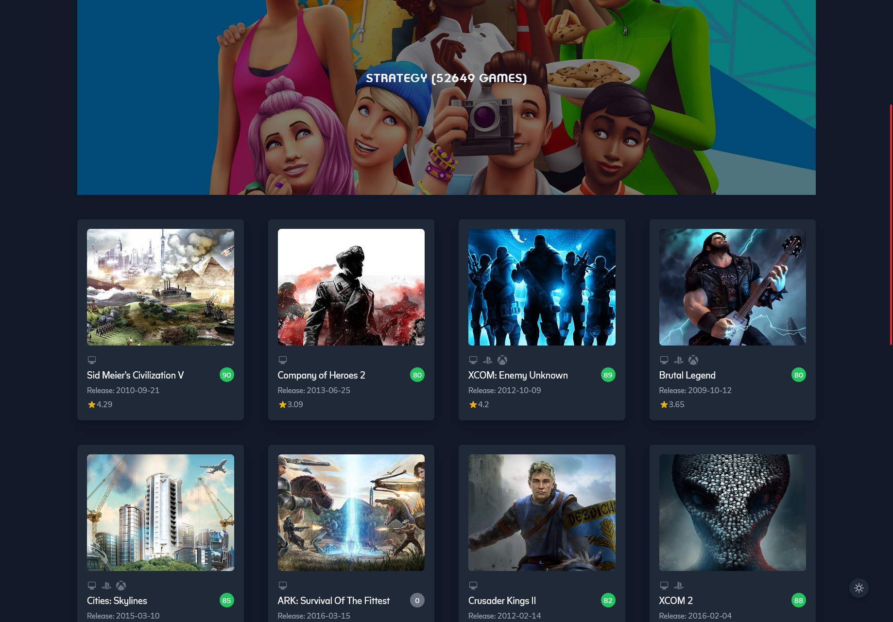

# GameVerse - Video Game Website

## Description

This is a website that allows users to browse and search for video games. All games are pulled from the RAWG API. Users can get detailed information about each game, including a description, screenshots, and a list of developers and publishers. Users can also view games by genre. The website is fully responsive and works on mobile devices, tablets, and desktops.

## Technologies Used

- HTML
- CSS
- JavaScript
- React
- Tailwind CSS
- RAWG API
- React Router
- Axios
- React Icons
- React Query
- etc.

## Screenshots

## Features

- Users can create an account and log in
- Users can save games to their favorites list and remove them from their favorites list.

### [Deployed Application](https://gameverse-zeta.vercel.app/)
